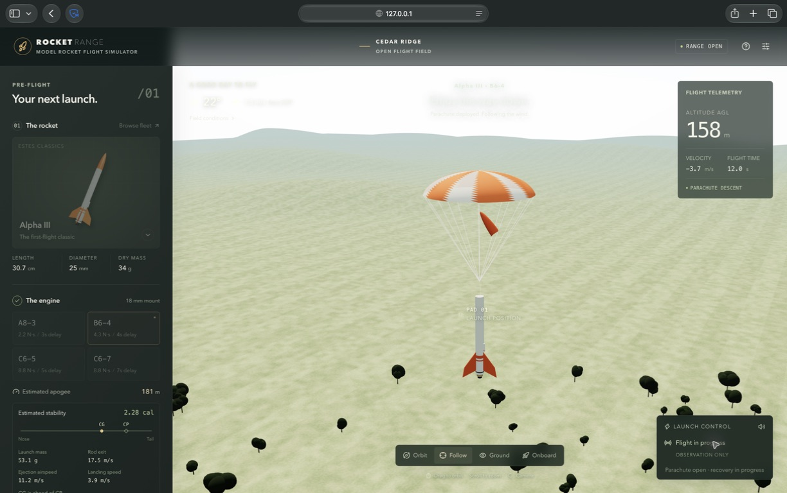

# Rocket Range

Choose a model rocket and compatible motor, prepare the pad, launch, and watch physics-driven flight and parachute recovery.

The project has two independent applications:

| Platform | Location | Status |
| --- | --- | --- |
| Desktop browser | [web/](web/) | Playable React / Three.js simulator with 16 rockets |
| iPhone and iPad | [ios/](ios/) | Native Unity game in development; [goals and milestones](ios/GOALS.md) |



## Run the browser game

Requires Node.js 22.13+ and npm.

```sh
cd web
npm ci
npm run dev
```

Use the local URL printed by Vite. If port 5173 is occupied, use `npm run dev -- --port 5174`. The complete browser guide and additional screenshots are in [web/README.md](web/README.md).

## Native development

The iOS/iPadOS version uses Unity 6 and URP. Follow [ios/README.md](ios/README.md) for the local editor/build workflow and [ios/GOALS.md](ios/GOALS.md) for progress. The browser implementation is preserved and is not a native web wrapper.

## Contributing

Read [AGENTS.md](AGENTS.md) and the guide inside the platform directory before editing. Commit early and often. Both games run locally; this repository contains no hosting or GitHub automation.

Before pushing, run `node web/scripts/check-public-repo.mjs` from the repository root and Gitleaks. See [CONTRIBUTING.md](CONTRIBUTING.md) and [SECURITY.md](SECURITY.md).

## License

Original code is [MIT](LICENSE). Third-party models retain their own terms; see [asset credits](web/ASSETS.md) and [model attribution](web/public/models/ATTRIBUTION.md). This project is not affiliated with Estes, NASA, or SpaceX.
